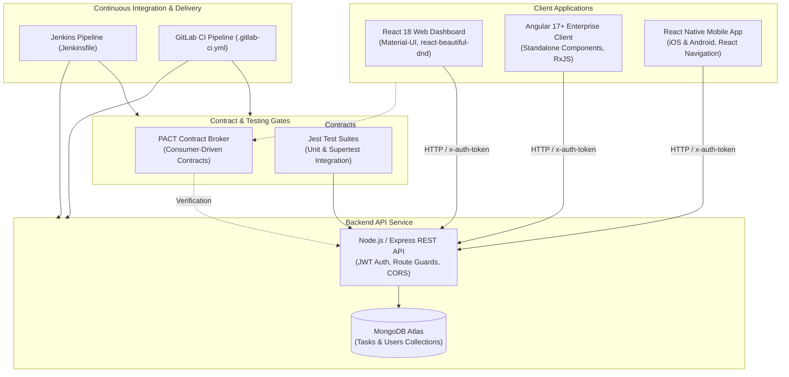
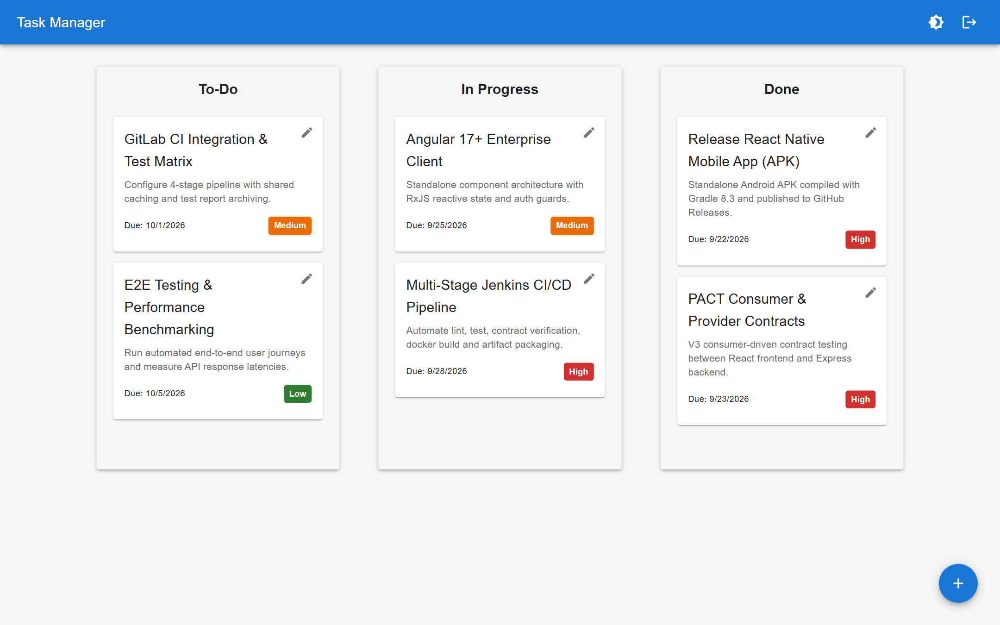
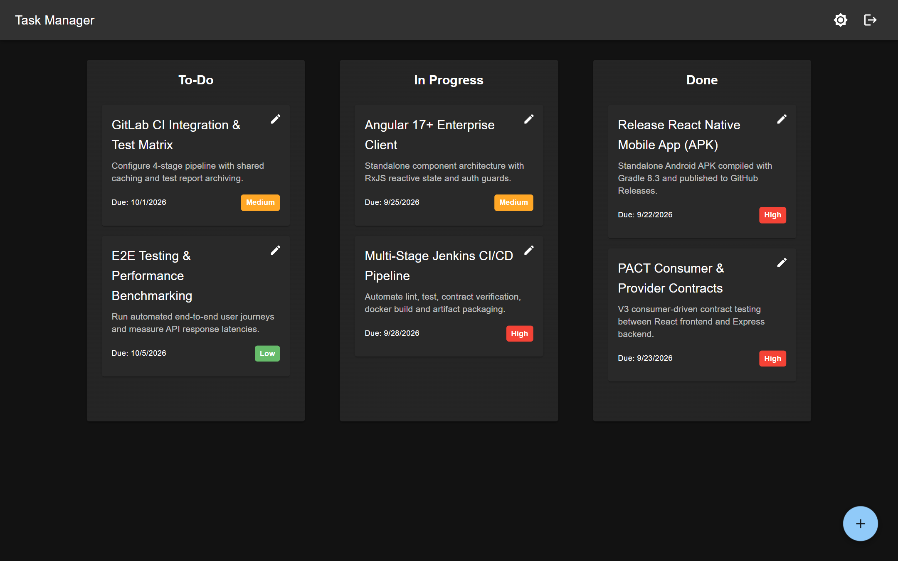
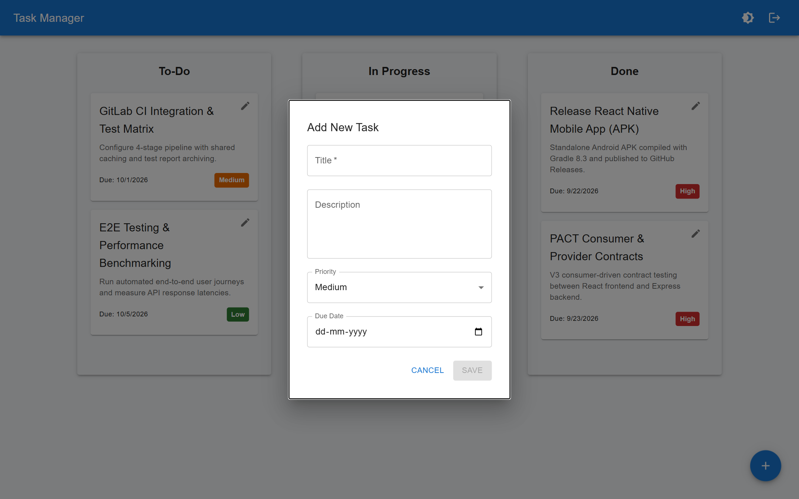
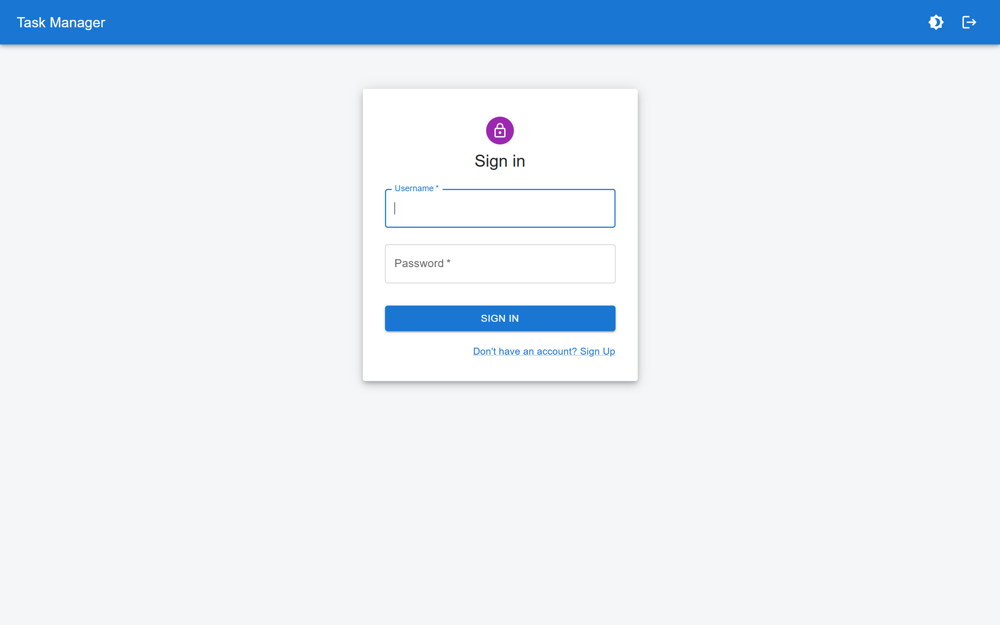
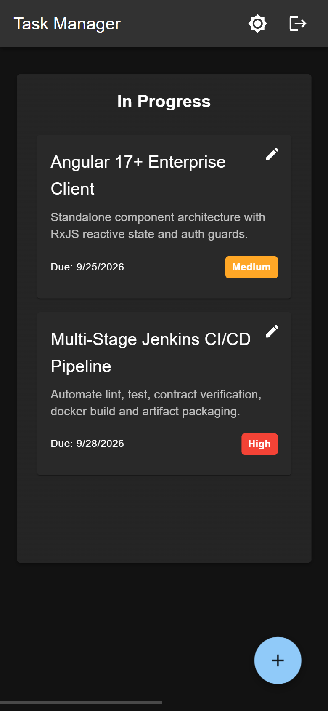

# TaskFlow — Enterprise Multi-Client Task Management Platform

[](https://react.dev/)
[](https://reactnative.dev/)
[](https://angular.dev/)
[](https://jestjs.io/)
[](https://pact.io/)
[](https://www.jenkins.io/)
[](https://docs.gitlab.com/ee/ci/)
[](https://github.com/Ashutosh-Yadav-256/MERN-task-manager/releases/tag/v1.0.0)

An enterprise-grade, multi-client task management platform demonstrating clean architecture across web, mobile, and backend micro-architectures. Features a **Node.js/Express REST API**, a **React 18** web dashboard, an **Angular 17+ standalone enterprise client**, a **React Native (Expo)** cross-platform mobile application, **Jest** unit/integration suites, **PACT** consumer-driven contract testing, and dual **Jenkins** / **GitLab CI** deployment pipelines. Direct APK download available on [GitHub Releases](https://github.com/Ashutosh-Yadav-256/MERN-task-manager/releases/tag/v1.0.0).

---

## Multi-Client Architecture Overview



---

## Application Demo & Visual Showcase

### 1. Interactive Kanban Dashboard (Light & Dark Theme)
TaskFlow features a responsive three-column workflow board (`To-Do`, `In Progress`, `Done`) with priority badges (`High` red, `Medium` amber, `Low` green), due dates, and seamless theme switching.

| Light Mode Dashboard | Dark Mode Dashboard |
| :---: | :---: |
|  |  |

### 2. Task Management & Modal Workflow
Create and edit tasks with real-time status updates, priority tags, and deadline tracking through an accessible modal dialog.

| Task Creation & Edit Modal | Secure Authentication & Sign In |
| :---: | :---: |
|  |  |

### 3. Cross-Platform Mobile Experience
The platform provides a responsive mobile interface alongside native iOS & Android applications. Download the compiled standalone Android APK directly from [GitHub Releases](https://github.com/Ashutosh-Yadav-256/MERN-task-manager/releases/tag/v1.0.0).

<p align="center">
  
</p>

---

## Core Capabilities & Skills

### 1. React Native Cross-Platform Mobile Client (`mobile/`)
* **iOS & Android Support**: Native task management built with React Native 0.73 and Expo SDK 50.
* **Platform-Aware Networking**: Auto-detects runtime host (`10.0.2.2` on Android emulator, `localhost` on iOS simulator).
* **Native Navigation**: Stack navigation with `@react-navigation/stack` and auth state switching.
* **Feature Highlights**:
  * Segmented status filtering (`All`, `To-Do`, `In Progress`, `Done`).
  * One-tap status cycle progression with instant optimistic UI response.
  * Pull-to-refresh with `RefreshControl`.
  * Priority color indicators (`High` red, `Medium` amber, `Low` green).
  * Native bottom-sheet modal for adding and updating tasks.

### 2. Angular 17+ Enterprise Web Client (`angular-client/`)
* **Modern Standalone Architecture**: Built with zero `NgModule` boilerplate using standalone components (`NavbarComponent`, `LoginComponent`, `RegisterComponent`, `BoardComponent`, `TaskModalComponent`).
* **RxJS Reactive State**: `AuthService` manages authentication sessions and user profiles via `BehaviorSubject` streams.
* **Functional HTTP Interceptors**: `authInterceptor` automatically injects the `x-auth-token` header into all outbound requests.
* **Route Guards**: `authGuard` prevents unauthenticated access to the Kanban board.
* **Enterprise Kanban Interface**: Three-column workflow board with modal task management, priority tags, and status progression.

### 3. Jest Testing Suite (Backend & Frontend)
* **Backend Unit & Integration Tests**: 100% test pass rate with Supertest covering:
  * `auth.middleware.test.js`: Token validation, missing header rejection (401), invalid signature handling.
  * `users.test.js`: Registration, duplicate username prevention, password hashing, credential verification, and JWT issuance.
  * `tasks.test.js`: Task querying, creation, updating, ownership isolation, and deletion.
* **Frontend Component Tests**: Unit tests with React Testing Library testing task card rendering, priority styling, and edit/delete callbacks.

### 4. PACT Consumer-Driven Contract Testing (`pact/`)
* **Consumer Contract Generation** (`tasks.consumer.pact.test.js`):
  * Defines expected API contract using `@pact-foundation/pact` V3 specification.
  * Generates pact contract artifact: `backend/pacts/TaskManagerFrontend-TaskManagerBackend.json`.
* **Provider Contract Verification** (`tasks.provider.pact.test.js`):
  * Spins up verification target server and verifies that the backend satisfies all consumer interactions (`GET /tasks`, `POST /users/login`).

### 5. Enterprise CI/CD Automation
* **Jenkins Pipeline** (`Jenkinsfile`):
  * Multi-stage declarative pipeline: Environment Verification -> Parallel Dependency Installation (Backend, Frontend, Angular, Mobile) -> Jest Test Execution -> PACT Contract Verification & Artifact Archiving -> Production Builds -> Docker Container Packaging.
* **GitLab CI** (`.gitlab-ci.yml`):
  * 4-stage pipeline (`install`, `test`, `contract-test`, `build`) with caching and artifact storage.

---

## Directory Structure

```text
MERN-task-manager/
├── backend/                        # Node.js & Express REST API
│   ├── __tests__/                  # Jest Unit & Integration Test Suites
│   │   ├── auth.middleware.test.js # Middleware unit tests
│   │   ├── users.test.js           # User registration & auth tests
│   │   ├── tasks.test.js           # Task CRUD integration tests
│   │   └── contract/               # PACT Consumer & Provider Tests
│   ├── middleware/                 # JWT Authentication Middleware
│   ├── models/                     # Mongoose Models (Task, User)
│   ├── routes/                     # Express Routers (/tasks, /users)
│   ├── pacts/                      # Generated PACT Contract JSON Artifacts
│   ├── jest.config.js              # Jest configuration
│   └── server.js                   # Express application entry point
├── frontend/                       # React 18 Web Client
│   ├── src/
│   │   ├── __tests__/              # React Testing Library component tests
│   │   ├── components/             # React components (TaskCard, Navbar, Column)
│   │   ├── context/                # AuthContext & ThemeContext
│   │   └── pages/                  # DashboardPage, LoginPage, RegisterPage
├── angular-client/                 # Angular 17+ Enterprise Standalone Client
│   ├── src/app/
│   │   ├── components/             # Standalone Components (Board, Login, Register, Modal)
│   │   ├── guards/                 # Route guards (authGuard)
│   │   ├── interceptors/           # HTTP Interceptors (authInterceptor)
│   │   ├── models/                 # TypeScript interfaces (Task, User)
│   │   └── services/               # Angular services (AuthService, TaskService)
│   └── angular.json                # Angular CLI configuration
├── mobile/                         # React Native (Expo) Cross-Platform App
│   ├── src/
│   │   ├── components/             # Native components (TaskModal)
│   │   ├── context/                # Mobile AuthContext
│   │   ├── screens/                # Native Screens (LoginScreen, RegisterScreen, TasksScreen)
│   │   └── services/               # Mobile Axios API client
│   ├── App.js                      # Root Stack Navigator
│   └── app.json                    # Expo configuration
├── Jenkinsfile                     # Declarative multi-stage Jenkins CI/CD pipeline
├── .gitlab-ci.yml                  # GitLab CI pipeline configuration
└── README.md                       # Architecture & Documentation
```

---

## Quick Start Guide

### 1. Backend Setup & Testing
```bash
cd backend
npm install

# Run Jest unit & integration tests
npm test

# Run PACT consumer contract tests and provider verification
npm run test:contract

# Run all test suites
npm run test:all

# Start local server
npm start
```
Server runs on `http://localhost:5000`.

### 2. React 18 Web Client
```bash
cd frontend
npm install
npm test -- --watchAll=false
npm start
```
Runs at `http://localhost:3000`.

### 3. Angular 17+ Enterprise Client
```bash
cd angular-client
npm install
npm start
```
Runs at `http://localhost:4200`.

### 4. React Native Mobile App
```bash
cd mobile
npm install
npm start
```
Press `a` for Android Emulator or `i` for iOS Simulator.

---

## Testing Commands Summary

| Scope | Technology | Command |
| :--- | :--- | :--- |
| **Backend Unit & Integration** | Jest + Supertest | `cd backend && npm test` |
| **Consumer Contract Test** | Pact JS V3 | `cd backend && npm run test:contract:consumer` |
| **Provider Verification** | Pact JS Verifier | `cd backend && npm run test:contract:provider` |
| **Full Backend Quality Gate** | Jest + Pact | `cd backend && npm run test:all` |
| **React Component Tests** | React Testing Library | `cd frontend && npm test -- --watchAll=false` |

---

## License
This project is licensed under the MIT License.
